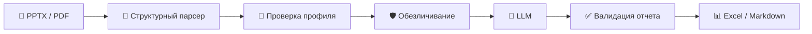

<div align="center">


# 🧠 Psycho Portrait

### Психологические тесты превращаются в проверяемую характеристику и Excel

Загрузите один или несколько PPTX/PDF, получите структурированный черновик для каждого сотрудника и выгрузите все результаты одной книгой Excel.

[](https://www.python.org/)
[](https://fastapi.tiangolo.com/)
[](https://github.com/Saborrr/psycho-portrait/actions/workflows/tests.yml)
[](LICENSE)
[](#-приложение-на-android)
[](#-защита-персональных-данных)

[Возможности](#-возможности) · [Быстрый старт](#-быстрый-старт) · [Пакетная загрузка](#-пакетная-загрузка) · [Android](#-приложение-на-android) · [Безопасность](#-защита-персональных-данных) · [Документация](docs/)

**Автор и сопровождающий проекта: [Saborrr](https://github.com/Saborrr)**

</div>

---

> [!IMPORTANT]
> Psycho Portrait формирует рабочую гипотезу для квалифицированного специалиста, а не медицинский диагноз и не автоматическое кадровое решение. Итоговую характеристику необходимо проверить до использования.

## ✨ Возможности

| | Что умеет проект |
|---|---|
| 📎 **PPTX и PDF** | Читает таблицы, текст и встроенные данные диаграмм, при необходимости использует OCR для PDF |
| 🧩 **Структурный парсинг** | Извлекает профиль сотрудника, 15 показателей СМИЛ и корпоративные тестовые блоки из реальных шаблонов |
| 🤖 **Несколько LLM** | Работает с Qwen, MiMo, DeepSeek, GLM, OpenAI, Gemini, MiniMax и совместимыми API |
| ✅ **Проверяемый отчет** | Требует четыре содержательных раздела не менее 100 слов и минимум 10 практических рекомендаций |
| 📊 **Пакетный Excel** | Обрабатывает до 25 документов за запуск и собирает характеристики с фотографиями в одну книгу `.xlsx` |
| 📱 **Веб и Android** | Встроенная адаптивная веб-панель устанавливается на Android как PWA |
| 🛡️ **Privacy by design** | Не передает ФИО и биографию во внешнюю LLM, не хранит историю без явного включения |
| 🔐 **Защищенная история** | При включении использует Fernet-шифрование, HMAC-дедупликацию и настраиваемый срок хранения |

## 🔄 Как это работает



1. Сервер проверяет расширение, размер и структуру загруженного документа.
2. Парсер извлекает показатели, служебные шкалы, текстовые поля и фотографию.
3. Перед генерацией формируется обезличенный контекст: без ФИО, имени файла, точной должности и биографии.
4. LLM возвращает строго структурированный отчет, который приложение повторно проверяет.
5. Результат можно скачать как Markdown или добавить в общую книгу Excel.

## 🎯 Что получается на выходе

Каждая характеристика содержит пять разделов:

1. **Эмоциональная природа мотивации**
2. **Стиль управления**
3. **Стиль коммуникации**
4. **Факторы риска**
5. **Практические рекомендации**

В первых четырех разделах должно быть не менее 100 слов. Рекомендаций должно быть не менее 10. Технические названия шкал и клинические термины не попадают в итоговый текст.

## 🚀 Быстрый старт

### Вариант 1. Docker, рекомендуется

```bash
git clone https://github.com/Saborrr/psycho-portrait.git
cd psycho-portrait
cp .env.example .env
docker compose up --build -d
```

Откройте `.env` и задайте как минимум:

```env
LLM_PROVIDER=qwen
LLM_API_KEY=ваш-ключ-провайдера
APP_API_KEY=длинная-случайная-строка
```

После запуска откройте [http://127.0.0.1:8000](http://127.0.0.1:8000).

Случайный ключ для `APP_API_KEY` можно создать командой:

```bash
python -c "import secrets; print(secrets.token_urlsafe(48))"
```

### Вариант 2. Python

```bash
git clone https://github.com/Saborrr/psycho-portrait.git
cd psycho-portrait
python3 -m venv .venv
source .venv/bin/activate
pip install -r requirements.txt
cp .env.example .env
uvicorn app.main:app --host 127.0.0.1 --port 8000
```

<details>
<summary><strong>Запуск Python в Windows</strong></summary>

```powershell
py -m venv .venv
.venv\Scripts\Activate.ps1
pip install -r requirements.txt
copy .env.example .env
uvicorn app.main:app --host 127.0.0.1 --port 8000
```

</details>

## 📦 Пакетная загрузка

Пакетный режим предназначен для подготовки одной Excel-книги сразу по группе сотрудников.

```text
несколько PPTX/PDF → проверка каждого файла → разбор → обезличенная генерация
                   → валидация → одна строка на сотрудника → общий XLSX
```

1. Перетащите в веб-панель несколько `.pptx` или `.pdf`.
2. Проверьте список и нажмите **«Сформировать Excel»**.
3. Приложение последовательно обработает документы, чтобы не превысить лимиты LLM.
4. Браузер скачает `psychological_characteristics.xlsx`.

В книге создается одна строка на сотрудника: ФИО и должность, четыре раздела характеристики, рекомендации, служебный статус и фотография. Формулы из пользовательских полей экранируются для защиты от Excel formula injection.

По умолчанию разрешено до 25 файлов (`MAX_BATCH_FILES=25`). Для первой проверки лучше загружать по 5–10 документов. Если один файл или ответ LLM не пройдет валидацию, приложение покажет ошибку вместо неполной книги.

## 📱 Приложение на Android

Отдельный APK для основной работы не нужен. Веб-панель уже является Progressive Web App.

1. Разместите Psycho Portrait на сервере с HTTPS или откройте его через корпоративный VPN.
2. Откройте адрес в Chrome на Android.
3. Выберите **Меню → Установить приложение** или **Добавить на главный экран**.
4. Запускайте сервис с иконки как обычное приложение.
5. Введите `APP_API_KEY`, подтвердите полномочия и выберите документы через приложение «Файлы».

Service worker кэширует только оболочку интерфейса. Документы, ответы API и характеристики не сохраняются в браузерном кэше. Нативный APK имеет смысл только для Google Play, биометрической аутентификации или корпоративного MDM.

## 🌐 Где запускать

| Режим | Для чего подходит | Особенности |
|---|---|---|
| **Локально** | Разработка и разовая проверка | Доступ только с текущего компьютера |
| **Собственный сервер** | Постоянная работа с компьютера и телефона | Рекомендуются HTTPS, VPN, резервное копирование и контроль доступа |
| **Отдельный сайт** | Не требуется | Веб-панель уже встроена в FastAPI |
| **Android PWA** | Мобильная загрузка файлов | Нужен доступ к запущенному серверу по HTTPS |

Рекомендуемая рабочая схема:

```text
Компьютер / Android → HTTPS или VPN → Psycho Portrait → обезличенный запрос → LLM API
```

Docker публикует приложение только на `127.0.0.1:8000`. На сервере подключите reverse proxy с TLS. Не открывайте порт `8000` напрямую в интернет.

## 🛡️ Защита персональных данных

Психологические результаты и даже псевдонимизированные показатели могут быть чувствительными данными. Проект использует следующие защитные меры:

- все маршруты `/api/*` закрыты ключом `APP_API_KEY`;
- ФИО, имя файла, точная должность, адрес, семейное положение, образование, история работы и исходный текст не отправляются LLM;
- история выключена по умолчанию: `STORE_HISTORY=false`;
- при включении истории профиль и отчет хранятся в Fernet-зашифрованном блоке;
- дедупликация выполняется по HMAC, а не по открытому SHA-256;
- исходный текст не сохраняется без отдельного `STORE_RAW_TEXT=true`;
- срок хранения ограничивается `DATA_RETENTION_DAYS`;
- API-ответы используют `Cache-Control: no-store`;
- ограничиваются размер файла, число слайдов, распакованный размер PPTX и степень ZIP-сжатия;
- Docker-контейнер работает не от `root`, без Linux capabilities и с read-only файловой системой.

> [!CAUTION]
> Перед реальной эксплуатацией оформите законное основание обработки, согласие при необходимости, роли доступа, порядок удаления и резервные копии с шифрованием. Для максимальной изоляции используйте локальную LLM внутри контролируемого контура.

Подробная модель угроз и рекомендации находятся в [docs/privacy.md](docs/privacy.md).

## 🧪 Методики и правила интерпретации

Проект распознает СМИЛ/MMPI и корпоративные блоки, встречающиеся в предоставленном формате: интеллект, активность, эмпатию, служебные отношения, жизненные парадигмы, социокультурные ориентиры, отношение к дискомфорту и безопасности.

Ключевые правила:

- интерпретируется целостный профиль и сочетания показателей, а не одна шкала отдельно;
- достоверность СМИЛ проверяется до генерации;
- пятая шкала трактуется одинаково для мужчин и женщин: выше — в сторону феминизированности, ниже — в сторону мускулинности;
- высокое значение социальной интроверсии означает интровертированность, низкое — экстравертированность;
- корпоративные проценты не выдаются за общепопуляционные перцентили;
- итог формулируется через вероятные рабочие проявления без клинических ярлыков.

Методические материалы и ограничения описаны в [docs/sources.md](docs/sources.md), а требования к презентациям — в [docs/presentation_template.md](docs/presentation_template.md).

## ⚙️ Конфигурация

<details>
<summary><strong>Основные переменные окружения</strong></summary>

| Переменная | По умолчанию | Назначение |
|---|---:|---|
| `LLM_PROVIDER` | `qwen` | Провайдер модели |
| `LLM_API_KEY` | — | Секретный ключ LLM |
| `APP_API_KEY` | — | Ключ доступа к приложению |
| `MAX_UPLOAD_MB` | `25` | Максимальный размер одного файла |
| `MAX_BATCH_FILES` | `25` | Максимум файлов в пакете |
| `MAX_SLIDES` | `50` | Максимум слайдов или страниц |
| `STORE_HISTORY` | `false` | Включить зашифрованную историю |
| `STORE_RAW_TEXT` | `false` | Разрешить хранение исходного текста |
| `DATA_RETENTION_DAYS` | `30` | Срок хранения истории |
| `DATA_ENCRYPTION_KEY` | — | Fernet-ключ для истории |
| `CORS_ORIGINS` | localhost | Разрешенные источники веб-панели |
| `ENABLE_API_DOCS` | `false` | Включить Swagger/ReDoc |

Fernet-ключ создается так:

```bash
python -c "from cryptography.fernet import Fernet; print(Fernet.generate_key().decode())"
```

Полный шаблон находится в [.env.example](.env.example). Не коммитьте `.env`, API-ключи и ключ шифрования.

</details>

## 📡 API

Все маршруты `/api/*` требуют заголовок `X-API-Key`.

| Метод | Маршрут | Результат |
|---|---|---|
| `POST` | `/api/parse` | Проверенный структурированный профиль |
| `POST` | `/api/generate` | Характеристика одного сотрудника |
| `POST` | `/api/batch/generate-xlsx` | Общая книга Excel |
| `GET` | `/api/settings` | Режим хранения и срок удаления |
| `GET` | `/api/llm/providers` | Доступные LLM-провайдеры |
| `GET` | `/api/sessions` | История, если она включена |
| `GET` | `/api/sessions/{id}` | Одна сохраненная сессия |
| `DELETE` | `/api/sessions/{id}` | Удаление сессии |

```bash
curl -H "X-API-Key: $APP_API_KEY" \
  -F "file=@samples/sample_efko_full.pptx" \
  http://127.0.0.1:8000/api/generate
```

## 🧰 Разработка и тесты

```bash
pip install -r requirements-dev.txt
pytest -q
python -m compileall -q app
```

GitHub Actions запускает тесты для каждого push и pull request. Синтетические презентации находятся в `samples/`. Реальные документы сотрудников нельзя добавлять в Git, фикстуры, issue или CI.

<details>
<summary><strong>Структура проекта</strong></summary>

```text
psycho-portrait/
├── app/                    # API, парсеры, LLM, отчеты и защищенное хранение
│   ├── main.py
│   ├── pptx_structured.py
│   ├── methodology.py
│   ├── reporting.py
│   ├── excel_export.py
│   ├── security.py
│   └── storage.py
├── static/                 # Адаптивная веб-панель и PWA
├── docs/                   # Методика, шаблоны и защита данных
├── samples/                # Только синтетические примеры
├── tests/                  # Автоматические тесты
├── docker-compose.yml
├── Dockerfile
└── README.md
```

</details>

## 🗺️ Roadmap

- [x] Структурный парсер PPTX и PDF/OCR
- [x] Проверяемый отчет по пяти разделам
- [x] Пакетная загрузка и Excel с фотографиями
- [x] Защищенная веб-панель и Android PWA
- [x] Отключаемая зашифрованная история
- [ ] Очередь фоновой пакетной обработки с прогрессом
- [ ] Индивидуальные учетные записи, роли и аудит действий
- [ ] Локальный LLM-профиль без передачи данных во внешний API
- [ ] Экспорт оформленной характеристики в Word
- [ ] Нативная интеграция с корпоративными HR-системами

## 🤝 Участие в проекте

- Сообщайте об ошибках через [Issues](https://github.com/Saborrr/psycho-portrait/issues), но не прикладывайте реальные персональные данные.
- Для воспроизведения используйте только полностью синтетические документы.
- Предлагайте улучшения методик и парсеров через Pull Request.
- Если проект оказался полезен, поставьте ⭐ репозиторию.

## ⚖️ Этические ограничения

- Это программно сформированный черновик, а не окончательное психологическое заключение.
- Отчет нельзя использовать как единственное основание приема, увольнения, повышения или ограничения сотрудника.
- Доступ к результатам должен быть только у уполномоченных лиц.
- Перед передачей третьим лицам требуется проверить правовое основание и цель обработки.
- Методики описывают вероятные тенденции и актуальное состояние, а не «истинную личность» человека.

---

<div align="center">

Сделано для практикующих психологов и ответственной автоматизации HR-процессов.

**© 2026 [Saborrr](https://github.com/Saborrr) · [MIT License](LICENSE)**

</div>
